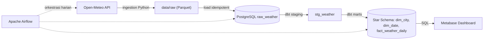
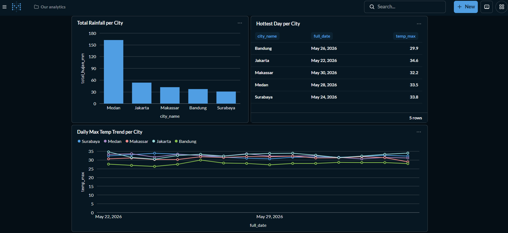
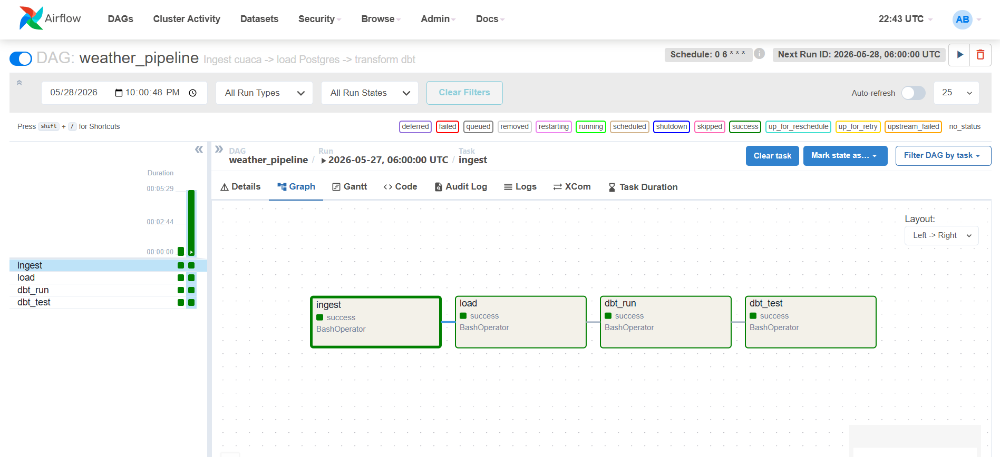
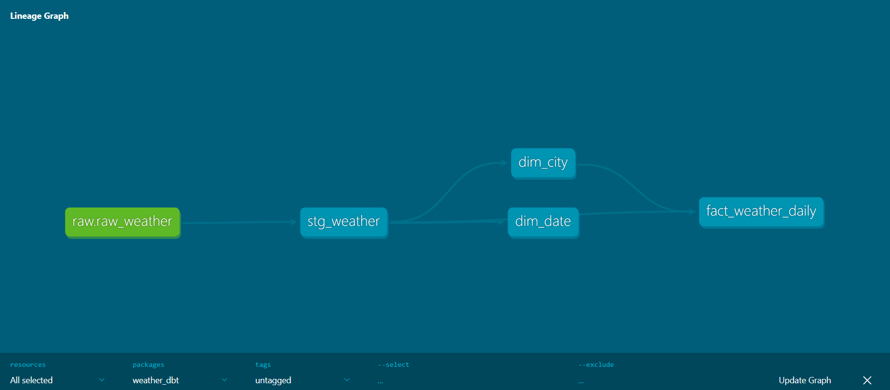

# 🌦️ Weather Data Pipeline Indonesia

Data pipeline **end-to-end** yang mengambil data cuaca harian beberapa kota Indonesia dari [Open-Meteo API](https://open-meteo.com/), memuatnya ke PostgreSQL, mentransformasikannya menjadi **star schema** dengan dbt, mengorkestrasinya dengan **Apache Airflow**, dan menyajikannya lewat dashboard **Metabase**.

> Proyek portofolio Data Engineering - dibangun dari nol untuk mendemonstrasikan alur kerja DE modern: ingestion, data warehousing, transformasi (ELT), orkestrasi, data quality, dan visualisasi.

---

## 🏗️ Arsitektur



**Alur:** `ingest → load → transform (dbt) → test → visualize`, dijadwalkan otomatis tiap hari oleh Airflow.

---

## 🧰 Tech Stack

| Lapisan             | Tools                                                               |
| ------------------- | ------------------------------------------------------------------- |
| Ingestion           | Python (`requests`, `pandas`, `pyarrow`)                            |
| Storage / Warehouse | PostgreSQL 16, Parquet (landing zone)                               |
| Transformasi        | **dbt** (staging → marts, star schema)                              |
| Orkestrasi          | **Apache Airflow** 2.9                                              |
| Data Quality        | dbt tests (`not_null`, `unique`, `relationships`, `accepted_range`) |
| Visualisasi         | **Metabase**                                                        |
| Infrastruktur       | **Docker Compose**                                                  |

---

## ✨ Fitur Utama

- **Ingestion idempotent** — upsert (`INSERT ... ON CONFLICT`) sehingga pipeline aman dijalankan ulang tanpa duplikat.
- **Dimensional modeling (star schema)** — `fact_weather_daily` + `dim_city` + `dim_date`, mengikuti metodologi Kimball.
- **Orkestrasi terjadwal** — DAG Airflow `weather_pipeline` berjalan harian dengan retry otomatis.
- **Data quality otomatis** — setiap pipeline run diuji dengan dbt tests (termasuk validasi rentang suhu yang masuk akal).
- **Sepenuhnya terkontainerisasi** — seluruh stack hidup dengan satu `docker compose up`.

---

## 📊 Data Model (Star Schema)

```
        dim_city                fact_weather_daily              dim_date
   ┌───────────────┐         ┌──────────────────────┐      ┌──────────────┐
   │ city_key (PK) │◄────────│ city_key (FK)        │─────►│ date_key (PK)│
   │ city_name     │         │ date_key (FK)        │      │ full_date    │
   │               │         │ temp_max / temp_min  │      │ year/month   │
   └───────────────┘         │ precipitation_sum    │      │ day/dow      │
                             │ windspeed_max        │      └──────────────┘
                             └──────────────────────┘
```

**Grain fakta:** satu baris = satu kota per satu hari.

---

## 🚀 Cara Menjalankan

**Prasyarat:** Docker Desktop, Python 3.11+, Git.

```bash
# 1. Siapkan environment
python -m venv .venv
.\.venv\Scripts\Activate.ps1        # Windows (macOS/Linux: source .venv/bin/activate)
pip install -r requirements.txt
Copy-Item .env.example .env          # isi kredensial Postgres

# 2. Nyalakan database
docker compose up -d postgres

# 3. Jalankan pipeline secara manual
python -m ingestion.fetch_weather    # ambil data dari Open-Meteo
python -m load.load_to_postgres      # muat ke PostgreSQL (idempotent)
cd dbt/weather_dbt && dbt build      # transform + test (star schema)

# 4. (Opsional) Nyalakan stack penuh + orkestrasi Airflow
docker compose up airflow-init       # sekali
docker compose up -d                 # Airflow + Metabase
# Airflow UI : http://localhost:8080  (admin/admin)
# Metabase   : http://localhost:3000
```

---

## 🖼️ Screenshot

**Dashboard Metabase**


**DAG Airflow (semua task hijau)**


**Lineage dbt**


---

## 🧠 Keputusan Desain

Bagian ini menjelaskan **kenapa**, bukan sekadar **apa** — inti dari engineering.

- **ELT, bukan ETL.** Data mentah dimuat dulu (`raw_weather`), transformasi dilakukan di dalam warehouse dengan dbt. Lebih fleksibel: logika bisa diubah & diproses ulang tanpa ingest ulang.
- **Landing zone Parquet.** Data mentah disimpan apa adanya sebagai sumber kebenaran, bisa diproses ulang kapan saja. Parquet (kolumnar) jauh lebih efisien dari CSV.
- **Star schema (Kimball).** Mempermudah & mempercepat query analitik; pola standar industri untuk warehouse.
- **Idempotency via upsert.** Krusial untuk orkestrasi — Airflow bisa retry task dengan aman tanpa menghasilkan duplikat.
- **Database Airflow terpisah.** Metadata Airflow disimpan di instance PostgreSQL terpisah agar tidak mengotori database analitik proyek.
- **Profil dbt berbasis env var.** Satu `profiles.yml` bekerja di host (`localhost`) maupun di dalam container (`postgres`), menghindari jebakan hostname.
- **Version pinning.** Image di-pin (`postgres:16`) untuk reproducibility — `latest` bisa berubah major version dan memecahkan proyek.

---

## ✅ Data Quality

Diuji otomatis lewat `dbt test` setiap pipeline run:

- `not_null` & `unique` pada surrogate key.
- `relationships` — integritas referensial fact → dim.
- `accepted_range` — suhu harus dalam rentang masuk akal (−20°C s/d 55°C) untuk menangkap anomali.

---

## 🔭 Pengembangan Selanjutnya

- Migrasi ke cloud warehouse (**BigQuery**) — model dbt yang sama, portabel.
- CI/CD (**GitHub Actions**) — lint + test otomatis tiap push.
- Source freshness & alerting saat pipeline gagal/data anomali.
- Tambah histori bertahun-tahun (Open-Meteo Archive API) + proses dengan Spark.

---

## 📂 Struktur Proyek

```
weather-pipeline/
├── config/cities.py            # daftar kota (lat/lon)
├── ingestion/fetch_weather.py  # ambil data Open-Meteo → Parquet
├── load/load_to_postgres.py    # muat raw → PostgreSQL (idempotent)
├── dbt/weather_dbt/            # transformasi (staging → star schema) + tests
├── airflow/dags/weather_dag.py # DAG orkestrasi harian
├── tests/                      # unit test (pytest)
├── docker-compose.yml          # Postgres + Airflow + Metabase
└── data/raw/                   # landing zone (gitignored)
```

---

_Dibuat sebagai proyek belajar Data Engineering. Feedback & saran sangat diterima!_
